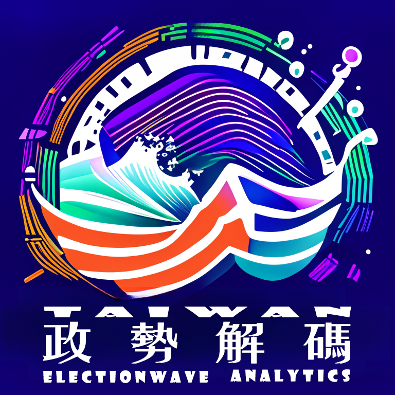

## Hi, I'm kenny    

- 🎓 I  graduated from chinese culture University with a degree in Finance and Banking.  

- :test_tube: However, my interests have shifted towards the information technology industry.

- 🪐 I'm enthusiastically pursuing the learning of new technologies.

- 🏐🏊🏸  I am a volleyball player who is also passionate about fitness, swimming, and badminton.

- :speech_balloon: I'm highly interested in DevOps  as well as cybersecurity.                         

- :speech_balloon: I have previously used Hugging Face, Langchain, OpenAI, and Jieba in projects and have a strong interest in NLP.

- :mailbox: Feel free to reach out to me through the provided link

####  familiar and experienced  tools

#### area of personal interest

#### my jobs
vulnerability scanning and web penetration 
white hat 

#### implementation project presentation
          

<!-- wi*quL3fcV -->

